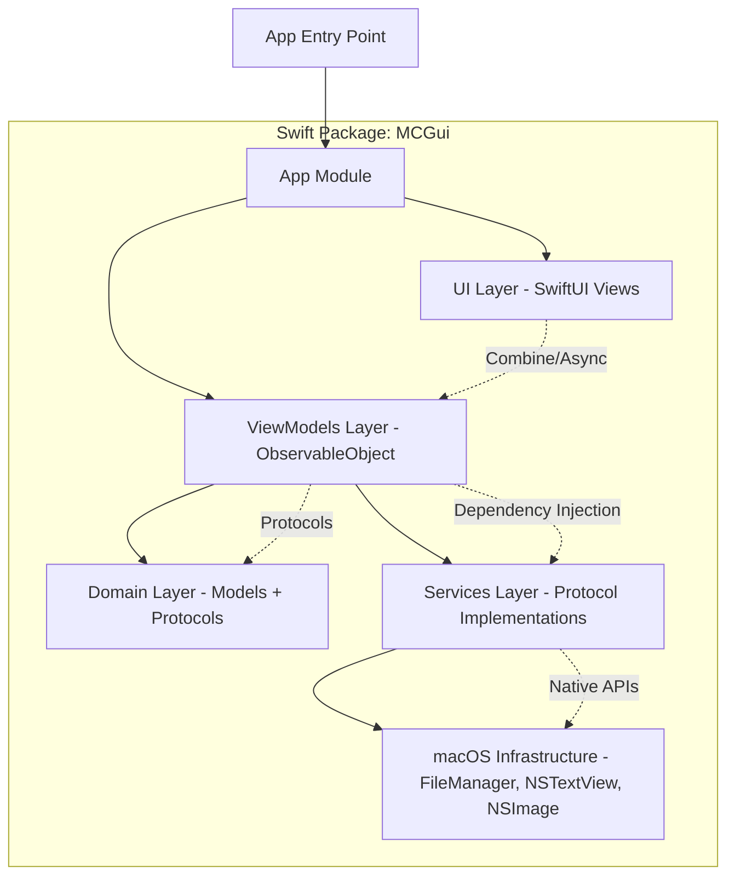

# Convert to Swift and SwiftUI Design

**Spec**: `.specs/features/convert-to-swift-swiftui/spec.md`
**Status**: Approved

---

## Architecture Overview

Complete rewrite from C#/.NET + Avalonia to native Swift/SwiftUI. Single Swift Package Manager package with feature-based module organization mirroring Clean Architecture layers.



### Module Structure

```
MCGui/
├── Package.swift
├── Sources/
│   ├── MCGuiApp/              # App entry, AppDelegate, Window management
│   ├── MCGuiCore/             # Domain models, protocols, business logic
│   │   ├── Models/            # FileEntry, PanelState, OperationResult, etc.
│   │   ├── Protocols/         # FileSystemService, EditorService, etc.
│   │   ├── Services/          # CopyMovePlanner, SelectionService
│   │   └── Extensions/        # URL, FileManager, Data extensions
│   ├── MCGuiUI/               # SwiftUI Views, ViewModels
│   │   ├── Views/             # MainWindow, PanelView, ViewerWindow, EditorWindow, Dialogs
│   │   ├── ViewModels/        # MainWindowViewModel, PanelViewModel, etc.
│   │   ├── Components/        # Reusable UI components (FileRow, Toolbar, StatusBar)
│   │   └── Commands/          # Keyboard shortcuts, Menu commands
│   └── MCGuiMacOS/            # macOS-specific implementations
│       ├── FileSystem/        # FileSystemServiceImpl using FileManager
│       ├── Editor/            # EditorServiceImpl wrapping NSTextView
│       ├── Viewer/            # ViewerServiceImpl (TextKit 2, NSImage, HexView)
│       ├── Trash/             # TrashServiceImpl using NSFileManager.trashItem
│       └── History/           # PathHistoryStoreImpl using JSON in App Support
├── Tests/
│   ├── MCGuiCoreTests/        # Unit tests for domain logic
│   ├── MCGuiUITests/          # ViewModel tests
│   └── MCGuiMacOSTests/       # Integration tests for macOS services
└── Resources/
    ├── Assets.xcassets        # App icons, colors
    └── Info.plist             # App metadata, permissions
```

---

## Code Reuse Analysis

### Existing Components to Leverage

| Component | Location | How to Use |
|-----------|----------|------------|
| Domain Models | `src/McGui.Core/Models/` | Direct port to Swift structs/enums; identical data shapes |
| Service Protocols | `src/McGui.Core/Interfaces/` | Direct port to Swift protocols; same method signatures |
| CopyMovePlanner | `src/McGui.Core/Services/CopyMovePlanner.cs` | Port algorithm logic; Swift async/await for file operations |
| SelectionService | `src/McGui.Core/Services/SelectionService.cs` | Port logic; use Swift Collections |
| ViewModels | `src/McGui.App/ViewModels/` | Port to Swift ObservableObject; Combine for reactive updates |
| Key Bindings | `src/McGui.App/EditorSearch.cs`, `McMenuDefinitions.cs` | Map to SwiftUI `.keyboardShortcut` and `Commands` |
| File Conflict Logic | `src/McGui.Infrastructure.macOS/NamingCollisionResolver.cs` | Port to Swift; use FileManager APIs |

### Integration Points

| System | Integration Method |
|--------|-------------------|
| macOS File System | `FileManager` + `NSFileProvider` for async operations |
| Text Editing | `NSTextView` wrapped in `NSViewRepresentable` with TextKit 2 |
| Image Viewing | `NSImage` + SwiftUI `Image` with zoom/pan gesture |
| Trash | `FileManager.trashItem(at:resultingItemURL:)` |
| Keyboard Shortcuts | SwiftUI `.keyboardShortcut` + `Commands` for menu bar |
| Persistence | `JSONEncoder`/`JSONDecoder` to `~/Library/Application Support/MCGui/` |
| Volume Monitoring | `FileManager` volume enumeration + `NSWorkspace` notifications |

---

## Components

### MCGuiApp Module

#### AppEntry
- **Purpose**: Application entry point, window lifecycle, menu bar setup
- **Location**: `Sources/MCGuiApp/AppEntry.swift`
- **Interfaces**:
  - `static func main()` - App entry
  - `func setupMenuBar()` - Configure native menu bar
  - `func createMainWindow()` - Create and show main window
- **Dependencies**: MCGuiUI, MCGuiCore
- **Reuses**: None (new SwiftUI app structure)

#### WindowManager
- **Purpose**: Manage multiple windows (main, viewer, editor, dialogs)
- **Location**: `Sources/MCGuiApp/WindowManager.swift`
- **Interfaces**:
  - `func showMainWindow()`
  - `func showViewer(for: FileEntry, panel: PanelSide)`
  - `func showEditor(for: FileEntry)`
  - `func showDialog<Content: View>(content: Content)`
- **Dependencies**: MCGuiUI
- **Reuses**: None

---

### MCGuiCore Module

#### Domain Models (`Models/`)
- **Purpose**: Pure Swift value types representing domain entities
- **Location**: `Sources/MCGuiCore/Models/`
- **Models** (1:1 port from C#):
  - `FileEntry` - name, path, size, dates, permissions, type, isHidden, isSymlink
  - `PanelState` - currentPath, entries, selectedIndices, sortColumn, sortAscending, showHidden, history
  - `OperationMode` - copy, move enum
  - `CopyMoveOptions` - preserveAttributes, followSymlinks, updateOnly
  - `CopyMovePlan` - source, destination, options, files array
  - `OperationProgress` - currentFile, totalFiles, bytesTransferred, totalBytes, speed, eta
  - `OperationResult` - success, errorMessage, processedCount, failedItems
  - `EditorDocumentState` - content, fileURL, isDirty, encoding
  - `ViewerState` - mode (text/image/hex), content, scrollPosition, searchQuery
  - `ViewerContent` - text, image, hexData enum
  - `PanelPathHistory` - past, future arrays of URLs
  - `PanelSortColumn` - name, size, date, type enum
  - `FileConflictResolution` - overwrite, skip, rename, cancel enum
  - `OperationResult` - success, errorMessage
- **Dependencies**: Foundation only
- **Reuses**: Direct port from C# Models

#### Protocols (`Protocols/`)
- **Purpose**: Define service contracts for dependency injection
- **Location**: `Sources/MCGuiCore/Protocols/`
- **Protocols**:
  - `FileSystemService` - listDirectory, createDirectory, copy, move, delete, trash, getVolumeInfo
  - `EditorService` - open, save, close, getContent, setContent, isDirty
  - `ViewerService` - load, nextFile, previousFile, search, setMode
  - `TrashService` - trash, emptyTrash
  - `PathHistoryStore` - save, load, clear
- **Dependencies**: MCGuiCore.Models
- **Reuses**: Direct port from C# Interfaces

#### Services (`Services/`)
- **Purpose**: Platform-agnostic business logic
- **Location**: `Sources/MCGuiCore/Services/`
- **Components**:
  - `CopyMovePlanner` - Plan copy/move operations with conflict detection
  - `SelectionService` - Manage multi-selection, range selection, invert
  - `PathHistoryManager` - In-memory history with back/forward navigation
- **Dependencies**: MCGuiCore.Protocols, MCGuiCore.Models
- **Reuses**: Port from C# CopyMovePlanner, SelectionService

---

### MCGuiUI Module

#### ViewModels (`ViewModels/`)
- **Purpose**: ObservableObject classes bridging UI and domain
- **Location**: `Sources/MCGuiUI/ViewModels/`
- **Components**:
  - `MainWindowViewModel` - App state, panel coordination, menu actions
  - `PanelViewModel` (x2) - Directory listing, selection, navigation, sorting
  - `CopyMoveDialogViewModel` - Operation config, conflict resolution
  - `ProgressDialogViewModel` - Progress tracking, cancel
  - `ConflictDialogViewModel` - File conflict resolution UI
  - `DeleteConfirmDialogViewModel` - Delete confirmation
  - `EditorWindowViewModel` - Editor state, dirty tracking, save
  - `ViewerViewModel` - Viewer state, mode switching, navigation
  - `MkdirDialogViewModel` - New folder name input
  - `SaveChangesDialogViewModel` - Save/Don't Save/Cancel
  - `ThemePreference` - System/Light/Dark enum with persistence
- **Dependencies**: MCGuiCore (Models, Protocols), Combine
- **Reuses**: Port from C# ViewModels; `@Published` for reactive UI

#### Views (`Views/`)
- **Purpose**: SwiftUI view hierarchy
- **Location**: `Sources/MCGuiUI/Views/`
- **Components**:
  - `MainWindow` - Root view with HSplitView for dual panels
  - `PanelView` - File list with keyboard navigation, context menu
  - `FileRow` - Individual file entry with icon, name, size, date
  - `ViewerWindow` - Modal viewer with mode tabs (Text/Image/Hex)
  - `EditorWindow` - Modal editor with NSTextView wrapper
  - `CopyMoveDialog` - Operation configuration
  - `ProgressDialog` - Progress bar, current file, speed, ETA
  - `ConflictDialog` - Overwrite/Skip/Rename/Cancel
  - `DeleteConfirmDialog` - Confirmation with file list
  - `MkdirDialog` - Folder name input
  - `SaveChangesDialog` - Save/Don't Save/Cancel
  - `Toolbar` - Function keys F1-F10, sort buttons, hidden toggle
  - `StatusBar` - Panel info, free space, selection count
- **Dependencies**: MCGuiUI.ViewModels, MCGuiUI.Components
- **Reuses**: Port from Avalonia XAML; SwiftUI declarative equivalents

#### Components (`Components/`)
- **Purpose**: Reusable UI primitives
- **Location**: `Sources/MCGuiUI/Components/`
- **Components**:
  - `FileIcon` - System icons for file types
  - `PermissionBadge` - rwx display
  - `SortIndicator` - Column header with sort direction
  - `LoadingOverlay` - Spinner with message
  - `ErrorAlert` - Standardized error presentation
  - `FocusableView` - Keyboard focus management
- **Dependencies**: SwiftUI
- **Reuses**: New SwiftUI components

#### Commands (`Commands/`)
- **Purpose**: Keyboard shortcuts and menu command definitions
- **Location**: `Sources/MCGuiUI/Commands/`
- **Components**:
  - `AppCommands` - `Commands` builder for menu bar
  - `KeyboardShortcuts` - All F-keys, Cmd+ shortcuts, navigation
  - `PanelCommands` - Panel-specific shortcuts (Enter, Backspace, arrows)
- **Dependencies**: SwiftUI
- **Reuses**: Port from C# `McMenuDefinitions.cs`, `EditorSearch.cs`

---

### MCGuiMacOS Module

#### FileSystemServiceImpl
- **Purpose**: macOS file system operations using FileManager
- **Location**: `Sources/MCGuiMacOS/FileSystem/FileSystemServiceImpl.swift`
- **Interfaces**: Implements `FileSystemService` protocol
- **Key Methods**:
  - `listDirectory(_ url: URL) async throws -> [FileEntry]`
  - `createDirectory(_ url: URL) async throws`
  - `copy(_ plan: CopyMovePlan) async throws -> OperationResult`
  - `move(_ plan: CopyMovePlan) async throws -> OperationResult`
  - `trash(_ urls: [URL]) async throws -> OperationResult`
  - `getVolumes() -> [VolumeInfo]`
- **Dependencies**: Foundation, MCGuiCore
- **Reuses**: Port from `MacFileSystemService.cs`; async/await replaces callbacks

#### EditorServiceImpl
- **Purpose**: Text editing via NSTextView with TextKit 2
- **Location**: `Sources/MCGuiMacOS/Editor/EditorServiceImpl.swift`
- **Interfaces**: Implements `EditorService` protocol
- **Key Methods**:
  - `open(_ url: URL) async throws -> EditorDocumentState`
  - `save(_ state: EditorDocumentState) async throws`
  - `close()`
- **Dependencies**: AppKit (NSTextView, NSTextStorage), MCGuiCore
- **Reuses**: Port from `MacEditorService.cs`; TextKit 2 for syntax highlighting

#### ViewerServiceImpl
- **Purpose**: File viewing (text, image, hex)
- **Location**: `Sources/MCGuiMacOS/Viewer/ViewerServiceImpl.swift`
- **Interfaces**: Implements `ViewerService` protocol
- **Key Methods**:
  - `load(_ url: URL) async throws -> ViewerContent`
  - `nextFile() async throws -> ViewerContent`
  - `previousFile() async throws -> ViewerContent`
  - `search(_ query: String) -> [SearchMatch]`
- **Dependencies**: AppKit (NSImage, NSTextView), MCGuiCore
- **Reuses**: Port from `MacViewerService.cs`; TextKit 2 for text, custom hex view

#### TrashServiceImpl
- **Purpose**: Move files to macOS Trash
- **Location**: `Sources/MCGuiMacOS/Trash/TrashServiceImpl.swift`
- **Interfaces**: Implements `TrashService` protocol
- **Key Methods**:
  - `trash(_ urls: [URL]) async throws -> OperationResult`
- **Dependencies**: Foundation (FileManager.trashItem)
- **Reuses**: Port from `MacTrashService.cs`

#### PathHistoryStoreImpl
- **Purpose**: Persist panel path history to JSON
- **Location**: `Sources/MCGuiMacOS/History/PathHistoryStoreImpl.swift`
- **Interfaces**: Implements `PathHistoryStore` protocol
- **Key Methods**:
  - `save(_ history: PanelPathHistory, for panel: PanelSide) async throws`
  - `load(for panel: PanelSide) async throws -> PanelPathHistory`
- **Dependencies**: Foundation, MCGuiCore
- **Reuses**: Port from `MacPathHistoryStore.cs`; JSON instead of custom format

---

## Data Models

### FileEntry
```swift
struct FileEntry: Identifiable, Hashable, Codable {
    let id = UUID()
    let name: String
    let path: URL
    let size: Int64
    let creationDate: Date
    let modificationDate: Date
    let permissions: FilePermissions
    let type: FileType
    let isHidden: Bool
    let isSymlink: Bool
    let symlinkTarget: URL?
}

enum FileType: String, Codable { case file, directory, symlink, volume, unknown }

struct FilePermissions: OptionSet, Codable {
    let rawValue: Int
    static let ownerRead = FilePermissions(rawValue: 1 << 0)
    static let ownerWrite = FilePermissions(rawValue: 1 << 1)
    static let ownerExecute = FilePermissions(rawValue: 1 << 2)
    static let groupRead = FilePermissions(rawValue: 1 << 3)
    static let groupWrite = FilePermissions(rawValue: 1 << 4)
    static let groupExecute = FilePermissions(rawValue: 1 << 5)
    static let otherRead = FilePermissions(rawValue: 1 << 6)
    static let otherWrite = FilePermissions(rawValue: 1 << 7)
    static let otherExecute = FilePermissions(rawValue: 1 << 8)
}
```

### PanelState
```swift
struct PanelState: Codable {
    var currentPath: URL
    var entries: [FileEntry]
    var selectedIndices: Set<Int>
    var sortColumn: PanelSortColumn
    var sortAscending: Bool
    var showHidden: Bool
    var history: PanelPathHistory
}
```

### CopyMovePlan
```swift
struct CopyMovePlan: Codable {
    let sourcePanel: PanelSide
    let destinationPath: URL
    let operation: OperationMode
    let options: CopyMoveOptions
    let files: [FileEntry]
}
```

**Relationships**: `PanelState` contains `FileEntry` array and `PanelPathHistory`. `CopyMovePlan` references `FileEntry` array. `OperationProgress` tracks `CopyMovePlan` execution.

---

## Error Handling Strategy

| Error Scenario | Handling | User Impact |
|----------------|----------|-------------|
| Directory read permission denied | Catch `CocoaError` code 257, show alert with path | Alert: "Cannot read directory: [path]" |
| File in use during copy/move | Detect `POSIXError.EBUSY`, retry with backoff | Dialog: "File in use. Retry / Skip / Cancel" |
| Disk full during write | Catch `POSIXError.ENOSPC`, pause operation | Dialog: "Disk full. Free space and Retry / Cancel" |
| Symlink target missing | Mark `FileEntry` as broken, distinct icon | Visual: red italic name, tooltip "Broken link" |
| Large directory (>10k entries) | Incremental load with `FileManager.enumerator` | Progressive rendering, loading indicator |
| Volume ejected during operation | Catch `POSIXError.ENOTCONN`, cancel gracefully | Alert: "Volume removed. Operation cancelled." |
| Path too long (>1024 chars) | Validate before operation, show error | Alert: "Path exceeds system limit" |
| JSON history corrupted | Catch `DecodingError`, reset to empty | Silent recovery, log warning |

---

## Risks & Concerns

| Concern | Location | Impact | Mitigation |
|---------|----------|--------|------------|
| NSTextView wrapping complexity | `MCGuiMacOS/Editor/` | High - text editing is core feature | Use `NSViewRepresentable` with Coordinator; TextKit 2 for syntax highlighting; test extensively |
| Large directory performance | `MCGuiMacOS/FileSystem/` | Medium - UI freeze on 10k+ files | Async enumeration, batch updates via `@MainActor`, virtualization in SwiftUI List |
| SwiftUI keyboard focus management | `MCGuiUI/Views/PanelView.swift` | High - keyboard-centric app | Custom `FocusableView` wrapper; explicit focus state per panel; test all shortcuts |
| Menu bar + keyboard shortcuts conflict | `MCGuiUI/Commands/` | Medium - shortcuts may not fire | Use `Commands` for menu, `.keyboardShortcut` for views; test F1-F10, Cmd+ combinations |
| TextKit 2 syntax highlighting | `MCGuiMacOS/Editor/` | Medium - new API, limited examples | Research TextKit 2 highlighter; fallback to basic coloring if needed |
| Volume change detection | `MCGuiMacOS/FileSystem/` | Low - P2 feature | `NSWorkspace.shared.notificationCenter` for `NSWorkspace.didMountNotification` |
| State restoration on launch | `MCGuiApp/AppEntry.swift` | Medium - user expectation | Restore window frames, panel paths, theme from UserDefaults/AppSupport |
| Hex viewer implementation | `MCGuiMacOS/Viewer/` | Medium - custom component | Build reusable `HexView` with virtualized scrolling; test 100MB files |

---

## Tech Decisions (non-obvious)

| Decision | Choice | Rationale |
|----------|--------|-----------|
| Package structure | Single SPM package with 4 targets | Simpler than multi-package; clear module boundaries; Xcode-friendly |
| Minimum macOS | 14.0 (Sonoma) | SwiftUI maturity, TextKit 2, async/await FileManager |
| Dependency injection | Manual protocol-based (no DI framework) | Lightweight; Swift protocols sufficient; testable with mocks |
| State management | `@Observable` (iOS 17+/macOS 14+) + `@Published` | Native, performant, no external deps; replaces Combine for UI |
| File operations | `async/await` with `TaskGroup` for parallelism | Structured concurrency; progress reporting via `AsyncStream` |
| Syntax highlighting | TextKit 2 `SyntaxHighlighter` | Native, performant; supports many languages |
| Hex view | Custom `NSViewRepresentable` with virtualization | No native hex view; virtualized for large files |
| Theme | `@AppStorage` + `.preferredColorScheme` | Persists automatically; follows system by default |
| Testing | Swift Testing (unit) + XCUITest (UI) | Modern, Apple-supported, integrates with SPM |
| Icons | SF Symbols + system file icons | Native look; zero asset maintenance |

---

## Project-Level Decisions (to add to STATE.md upon approval)

### AD-002: Swift Package Architecture
- **Decision**: Single Swift Package Manager package with 4 targets (App, Core, UI, MacOS) replacing the 3-project C# architecture (Core, Infrastructure, App).
- **Reason**: SwiftUI apps are typically single-package; module boundaries via Swift access control (`public`/`internal`/`package`) replace project boundaries. Clean Architecture layers preserved via target dependencies.
- **Trade-off**: Less enforced isolation than separate projects; relies on developer discipline and `package` access modifier.
- **Scope**: All future Swift features in this repository.
- **Supersedes**: AD-001 (C# project structure) for Swift implementation.

### AD-003: SwiftUI + AppKit Hybrid for Editor/Viewer
- **Decision**: Use `NSViewRepresentable` to wrap `NSTextView` (TextKit 2) for editor and text viewer; pure SwiftUI for image/hex viewers.
- **Reason**: No pure SwiftUI text editor matches NSTextView capability; TextKit 2 provides syntax highlighting, large file handling, accessibility.
- **Trade-off**: Requires AppKit bridging; not pure SwiftUI; but only for editor/viewer components.
- **Scope**: Editor and text viewer features.

---