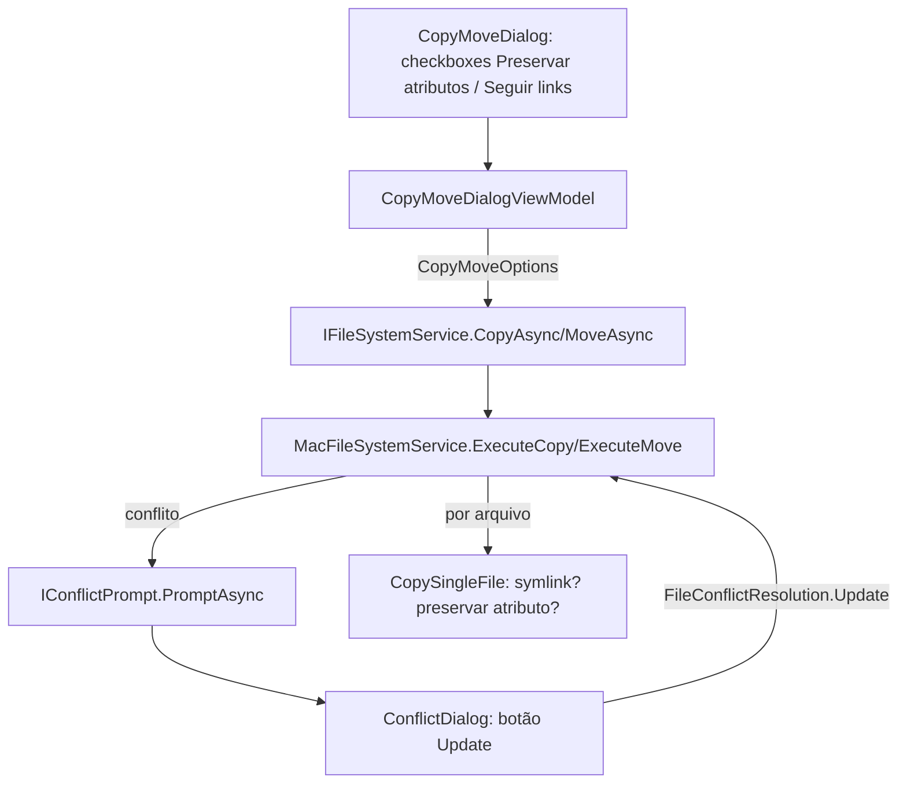

# Copy/Move MC Options Design

**Spec**: `.specs/features/copy-move-mc-options/spec.md`
**Status**: Approved

---

## Architecture Overview

Nenhum projeto novo. As três opções entram nas camadas já existentes, seguindo AD-001: `McGui.Core` ganha o novo valor de enum e o modelo de opções (puro, sem I/O); `McGui.Infrastructure.macOS` ganha a lógica real de comparação de timestamp, symlink e permissão Unix (única camada com API de SO); `McGui.App` ganha os dois checkboxes no diálogo e o botão "Update" no prompt de conflito, todos ligados aos mesmos `Command`s/fluxo que já existem.



Nenhuma API de SO nova é chamada fora de `McGui.Infrastructure.macOS` - `File.CreateSymbolicLink`, `File.GetUnixFileMode`/`SetUnixFileMode` (confirmados via Microsoft Learn, .NET 7+, `[UnsupportedOSPlatform("windows")]`) ficam only lá, consistente com o AD-001 (nenhuma decisão nova de layering, conformidade).

---

## Code Reuse Analysis

### Existing Components to Leverage

| Component | Location | How to Use |
| --- | --- | --- |
| `FileConflictResolution` enum | `src/McGui.Core/Models/FileConflictResolution.cs` | Ganha um 5º valor `Update`, sem remover os 4 existentes |
| `IConflictPrompt`/`ConflictPromptResult`/`ApplyToAll` | `src/McGui.App/ViewModels/IConflictPrompt.cs` | Reaproveitado sem mudança de forma - `Update` é só mais um valor possível de `Resolution` |
| `ConflictDialogViewModel`/`ConflictDialog.axaml` | `src/McGui.App/Views/ConflictDialog.axaml(.cs)`, `ViewModels/ConflictDialogViewModel.cs` | Ganha um `[RelayCommand] Update()` e um `<Button Content="Update" Command="{Binding UpdateCommand}"/>`, mesmo padrão dos 4 botões existentes |
| Conflito por arquivo (`File.Exists`/`Directory.Exists` + switch) | `MacFileSystemService.ExecuteCopy/ExecuteMove` | O `switch (resolution)` já existente ganha um `case FileConflictResolution.Update` |
| `OperationResult.Skipped` (lista de avisos/falhas por arquivo) | `src/McGui.Core/Models/OperationResult.cs` (inferido do uso em `MacFileSystemServiceTests`) | Reaproveitado para registrar falha de chmod/timestamp e symlink quebrado - nenhum novo tipo de erro |
| `FileEntry.IsSymlink`/`ModifiedUtc` (já detectados) | `BuildEntry`, `MacFileSystemService.cs:320-341` | Já dão tudo que a comparação de Update e o gate de symlink precisam - nenhum campo novo no `FileEntry` |
| `TempDirectoryFixture` (testes reais em disco) | `tests/McGui.Infrastructure.macOS.Tests/TempDirectoryFixture.cs` | Mesmo padrão de teste de integração real (sem mocks) usado pelos testes existentes de `MacFileSystemServiceTests` |

### Integration Points

| System | Integration Method |
| --- | --- |
| `IFileSystemService.CopyAsync`/`MoveAsync` | Ganham um parâmetro novo `CopyMoveOptions options` (registro simples, ver Data Models) - única mudança de assinatura de interface, propagada para a única implementação (`MacFileSystemService`) e ao único chamador (`CopyMoveDialogViewModel.ConfirmAsync`) |
| API Unix do .NET | `File.GetUnixFileMode(path)`/`File.SetUnixFileMode(path, mode)` para permissão; `File.CreateSymbolicLink(path, pathToTarget)` + `new FileInfo(origem).LinkTarget` (já usado em `BuildEntry`) para symlink - todas confirmadas via Microsoft Learn, disponíveis desde .NET 7, chamadas só em `McGui.Infrastructure.macOS` |

---

## Components

### `FileConflictResolution` (ajuste, sem componente novo)

- **Purpose**: Adicionar o valor `Update` ao enum de resolução de conflito.
- **Location**: `src/McGui.Core/Models/FileConflictResolution.cs`
- **Interfaces**: `enum FileConflictResolution { Overwrite, Skip, Rename, Update, Abort }` (ordem: `Update` entra antes de `Abort`, mantendo `Abort` como último valor "de saída", igual à ordem visual dos botões no diálogo hoje: Abort/Skip/Rename/Overwrite da esquerda pra direita, com Update entrando entre Rename e Overwrite).
- **Dependencies**: nenhuma.
- **Reuses**: enum já existente, só cresce um valor.

### `CopyMoveOptions` (modelo novo)

- **Purpose**: Carregar as duas opções configuráveis (preservar atributos, seguir links) da UI até a execução real, sem inflar a assinatura de `CopyAsync`/`MoveAsync` com dois `bool` soltos.
- **Location**: `src/McGui.Core/Models/CopyMoveOptions.cs`
- **Interfaces**: `public sealed record CopyMoveOptions(bool PreserveAttributes, bool FollowSymlinks)`, com um `public static readonly CopyMoveOptions Default = new(PreserveAttributes: false, FollowSymlinks: true)` (mesmos defaults do spec) pra uso nos testes existentes que hoje chamam `CopyAsync`/`MoveAsync` sem se importar com essas opções.
- **Dependencies**: nenhuma.
- **Reuses**: mesmo padrão de `sealed record` já usado por `CopyMovePlan`/`OperationProgress`.

### `IFileSystemService.CopyAsync`/`MoveAsync` (ajuste de assinatura)

- **Purpose**: Receber as opções da UI e repassá-las pra execução real.
- **Location**: `src/McGui.Core/Interfaces/IFileSystemService.cs`
- **Interfaces**: `Task<OperationResult> CopyAsync(CopyMovePlan plan, CopyMoveOptions options, IProgress<OperationProgress> progress, Func<string, FileConflictResolution> resolveConflict, CancellationToken ct)` (mesmo pra `MoveAsync`); `options` entra logo depois de `plan`, mesma posição relativa de "config antes de callbacks" já usada.
- **Dependencies**: `CopyMoveOptions`.
- **Reuses**: assinatura existente, só ganha um parâmetro.

### `MacFileSystemService.ExecuteCopy`/`ExecuteMove` (ajuste)

- **Purpose**: Aplicar a comparação de Update, o gate de symlink e a preservação de atributo por arquivo.
- **Location**: `src/McGui.Infrastructure.macOS/MacFileSystemService.cs`
- **Interfaces**:
  - `case FileConflictResolution.Update:` no switch já existente (`ExecuteCopy` e `ExecuteMove`) - compara `entry.ModifiedUtc` (origem) com `File.GetLastWriteTimeUtc(destinationPath)` (destino); se origem mais nova, cai no mesmo caminho de `Overwrite`; senão, mesmo caminho de `Skip`.
  - `private static void CopySingleFile(FileEntry entry, string destinationPath, CopyMoveOptions options, List<(string,string)> skipped)` - novo método privado, chamado no lugar do `File.Copy(...)` direto de hoje: decide symlink-vs-conteúdo, copia, e por último aplica atributo se `PreserveAttributes`.
  - `private static void ApplyPreservedAttributes(string sourcePath, string destinationPath, List<(string,string)> skipped)` - aplica `File.SetUnixFileMode`/`SetLastWriteTimeUtc`, capturando exceção de permissão/IO e registrando em `skipped` em vez de propagar.
- **Dependencies**: `CopyMoveOptions`.
- **Reuses**: `skipped` (lista já existente em `ExecuteCopy`/`ExecuteMove`), `File.Copy`/`Directory.CreateDirectory` já usados hoje.

### `CopyMoveDialogViewModel` (ajuste)

- **Purpose**: Expor os dois checkboxes como propriedades bindáveis e montar `CopyMoveOptions` ao confirmar.
- **Location**: `src/McGui.App/ViewModels/CopyMoveDialogViewModel.cs`
- **Interfaces**: `[ObservableProperty] private bool preserveAttributes = false;` e `[ObservableProperty] private bool followSymlinks = true;` (defaults do spec); `ConfirmAsync()` passa `new CopyMoveOptions(PreserveAttributes, FollowSymlinks)` pra `CopyAsync`/`MoveAsync`.
- **Dependencies**: `CopyMoveOptions`.
- **Reuses**: mesmo padrão de `[ObservableProperty]` já usado por `destinationDirectory`/`newName`.

### `CopyMoveDialog.axaml` (ajuste)

- **Purpose**: Exibir os dois novos checkboxes.
- **Location**: `src/McGui.App/Views/CopyMoveDialog.axaml`
- **Interfaces**: dois `<CheckBox Content="Preservar atributos" IsChecked="{Binding PreserveAttributes}" />` / `<CheckBox Content="Seguir links" IsChecked="{Binding FollowSymlinks}" />`, inseridos entre o campo "New name" e a área de erro/progresso.
- **Dependencies**: nenhuma nova.
- **Reuses**: mesmo `StackPanel`/`Spacing` já usado no diálogo.

### `ConflictDialogViewModel`/`ConflictDialog.axaml` (ajuste)

- **Purpose**: Expor a opção "Update" no prompt de conflito.
- **Location**: `src/McGui.App/ViewModels/ConflictDialogViewModel.cs`, `src/McGui.App/Views/ConflictDialog.axaml`
- **Interfaces**: `[RelayCommand] private void Update() => Complete(FileConflictResolution.Update);`; `<Button Content="Update" Command="{Binding UpdateCommand}" />` entre os botões "Rename" e "Overwrite".
- **Dependencies**: nenhuma nova.
- **Reuses**: `Complete(...)` já existente, mesmo padrão dos outros 4 comandos.

---

## Data Models

### `CopyMoveOptions`

```csharp
public sealed record CopyMoveOptions(bool PreserveAttributes, bool FollowSymlinks)
{
    public static readonly CopyMoveOptions Default = new(PreserveAttributes: false, FollowSymlinks: true);
}
```

**Relationships**: passado junto com `CopyMovePlan` para `IFileSystemService.CopyAsync`/`MoveAsync`; não persiste em disco, vive só durante uma operação.

### `FileConflictResolution` (ajuste, não modelo novo)

```csharp
public enum FileConflictResolution { Overwrite, Skip, Rename, Update, Abort }
```

---

## Error Handling Strategy

| Error Scenario | Handling | User Impact |
| --- | --- | --- |
| Falha ao aplicar `SetUnixFileMode`/timestamp (permissão negada, FS sem suporte a permissão Unix) | Capturado em `ApplyPreservedAttributes`, registrado em `OperationResult.Skipped` com a mensagem da exceção; a cópia do conteúdo do arquivo já aconteceu e não é revertida | Arquivo aparece copiado, mas a operação sinaliza aviso (mesmo mecanismo hoje usado pra outras falhas de I/O por arquivo) |
| Symlink de origem quebrado (`LinkTarget` aponta pra caminho inexistente) com `FollowSymlinks=true` | `CopySingleFile` detecta que o alvo resolvido não existe antes de copiar, pula o arquivo e registra em `Skipped` com motivo "broken symlink" | Arquivo não aparece no destino, listado como "skipped" na tela de resultado (mesmo padrão de hoje pra outros skips) |
| Conflito de diretório (não arquivo) com resolução `Update` durante Move | Tratado como `Overwrite` (deleta e move o diretório inteiro) - comparação de "mais novo" não é significativa no nível de diretório inteiro, já que o `Move` de hoje não faz merge parcial de diretórios | Nenhuma mudança de comportamento visível pra quem só usa Update em arquivos; documentado como simplificação deliberada (ver Risks & Concerns) |

---

## Risks & Concerns

| Concern | Location | Impact | Mitigation |
| --- | --- | --- | --- |
| `ExecuteMove` já tem fallback `Directory.Move` → `CopyDirectoryRecursively` + delete quando `Directory.Move` falha entre volumes; esse fallback recursivo (`CopyDirectoryRecursively`, linhas ~246-256) usa `File.Copy` direto, sem passar pelas novas opções | `src/McGui.Infrastructure.macOS/MacFileSystemService.cs:246-256` | Se não ajustado, `PreserveAttributes`/`FollowSymlinks` seriam ignorados justamente no caminho entre-volumes (cross-device), que é onde symlinks/atributos mais importam (cópia real de bytes, não um rename) | `CopyDirectoryRecursively` passa a chamar o mesmo `CopySingleFile` centralizado, em vez de `File.Copy` inline - uma tarefa dedicada em Tasks garante que os dois caminhos (cópia normal e fallback de Move) usam a mesma lógica |
| `Update` comparando `File.GetLastWriteTimeUtc` do destino direto (sem passar por `BuildEntry`) - já existe assimetria similar hoje (`File.Exists`/`Directory.Exists` puro pra detectar conflito, sem `FileEntry` do destino) | `src/McGui.Infrastructure.macOS/MacFileSystemService.cs:97-115` (`ExecuteCopy`), `~180-200` (`ExecuteMove`) | Nenhum - é o mesmo padrão já usado pra detectar conflito hoje, só adiciona uma leitura de timestamp | Nenhuma mitigação necessária, é conformidade com o padrão existente, não um risco novo |

> Nenhum outro concern encontrado nos arquivos tocados por esta feature.

---

## Tech Decisions

| Decision | Choice | Rationale |
| --- | --- | --- |
| Onde mora `CopyMoveOptions` | `McGui.Core.Models`, registro imutável com `Default` estático | Mesmo padrão de `CopyMovePlan`/`OperationProgress`; `Default` evita quebrar os testes existentes que chamam `CopyAsync`/`MoveAsync` sem opinião sobre as opções novas |
| Assinatura de `CopyAsync`/`MoveAsync` muda (breaking) vs. sobrecarga nova | Muda a assinatura existente (adiciona parâmetro), não cria overload | Único chamador real (`CopyMoveDialogViewModel`) e única implementação (`MacFileSystemService`) - overload duplicaria lógica sem necessidade real, direção contrária à simplicidade pedida pelo usuário |
| Onde ler o alvo do symlink pra recriar no destino | Reler via `new FileInfo(entry.FullPath).LinkTarget` no momento da cópia, em vez de adicionar campo novo em `FileEntry` | `FileEntry` é usado amplamente (Core, App, testes/fakes); adicionar campo obrigaria atualizar `FakeFileSystemService` e vários testes só pra um dado que já é barato de reler no momento certo |
| API de permissão Unix | `File.GetUnixFileMode(path)`/`File.SetUnixFileMode(path, mode)` (confirmado via Microsoft Learn - `System.IO`, disponível desde .NET 7, `[UnsupportedOSPlatform("windows")]`) | BCL padrão, sem P/Invoke; roda só em `McGui.Infrastructure.macOS`, conforme AD-001 |
| API de symlink | `File.CreateSymbolicLink(path, pathToTarget)` (confirmado via Microsoft Learn) | Mesma família de API (`System.IO`), já citada em código existente (`FileInfo.LinkTarget` já usado em `BuildEntry`) |

Nenhuma decisão aqui estabelece convenção de projeto nova além do que já está em AD-001 (conformidade, sem superseder).
