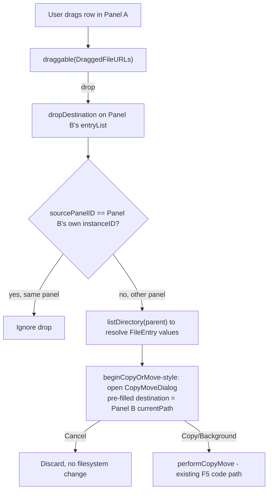

# Drag-and-Drop Copy Between Panels Design

**Spec**: `.specs/features/drag-drop-copy/spec.md`
**Status**: Draft

---

## Architecture Overview

Both panels already run as independent `PanelView` instances under `MainWindow`, each owning its own `PanelViewModel`, `selection` (cursor) and `markedIDs` (marks) state. Dragging attaches a `.draggable` payload to each row that resolves - at drag-start time - to either the single row's path or the whole marked set's paths, wrapped in one custom `Transferable` (`DraggedFileURLs`) so a single `.dropDestination` on the receiving panel's file list handles both cases identically. On drop, the destination panel resolves the incoming paths back into full `FileEntry` values via its own `FileSystemService.listDirectory`, then opens the exact same `CopyMoveDialog`/`CopyMoveDialogViewModel` flow F5 already uses.



---

## Approach Exploration

| Approach | Description | Trade-off |
| --- | --- | --- |
| **A - SwiftUI native Transferable (`draggable`/`dropDestination`)** ✅ recommended | Use the macOS 13+ `Transferable` protocol and the `.draggable`/`.dropDestination` view modifiers, confirmed present in the installed macOS SDK (`SwiftUI.swiftinterface`, macOS 14 target already required by this repo). | Pure SwiftUI, no new AppKit bridging. Requires one small custom `Transferable` wrapper type to carry more than one URL per drag. |
| B - Legacy `onDrag`/`onDrop` with `NSItemProvider` | The pre-Transferable API, still supported. | More boilerplate (manual `NSItemProvider` loading, `DispatchGroup`-style completion handling); its main advantage - working with drags to/from Finder or other apps - is explicitly out of scope for this feature. |
| C - `NSViewRepresentable`/`NSTableView` native drag source, like the existing double-click bridge (`TableDoubleClickInstaller`) | Full AppKit control (custom drag images, per-row drop feedback). | The double-click bridge exists only because SwiftUI's `List` had no reliable double-click signal; no equivalent SwiftUI gap exists for drag-and-drop on macOS 14, so this would add AppKit code for no behavioral benefit here. |

**Recommendation**: A. It matches the already-required macOS 14+ target, needs no new AppKit bridging, and every API used (`draggable`, `dropDestination`, `URL: Transferable`, `CodableRepresentation`) was confirmed present in this machine's installed SDK interface before choosing it.

---

## Code Reuse Analysis

### Existing Components to Leverage

| Component | Location | How to Use |
| --- | --- | --- |
| `CopyMoveDialog` / `CopyMoveDialogViewModel` | `Sources/MCGuiUI/Views/CopyMoveDialog.swift`, `Sources/MCGuiUI/ViewModels/CopyMoveDialogViewModel.swift` | Reused as-is for the confirmation dialog; only the call site changes (constructed from a drop instead of from F5). |
| `PanelView.performCopyMove(_:background:)` | `Sources/MCGuiUI/Views/PanelView.swift:409` (existing) | Reused unchanged for actually running the copy once the dialog confirms - identical to F5's path. |
| `PanelView.operationEntries` / `markedEntries` | `Sources/MCGuiUI/Views/PanelView.swift` (from the prior selection/marks fix) | The exact "marked set if the dragged row is marked, else just that row" rule this feature needs already exists as this computed property pattern - reused, not reimplemented. |
| `ConflictDialog` / `ConflictDialogViewModel` | `Sources/MCGuiUI/Views/ConflictDialog.swift` | Reused unchanged; `CopyMoveDialogViewModel.resolveConflict` already wires into it via `beginCopyOrMove`. |
| `otherPanelPath` wiring in `MainWindow.swift` | `Sources/MCGuiUI/Views/MainWindow.swift:99,115` | Confirms each `PanelView` already knows the other panel's current path; the drop target's own `currentPath` (not `otherPanelPath`) is what's pre-filled as destination, since the drop lands ON that panel. |
| `operationTask` in-flight guard | `Sources/MCGuiUI/Views/PanelView.swift` (`beginCopyOrMove`'s `guard operationTask == nil else { return }`) | Reused verbatim for the drop handler - a drop while an operation is running is ignored the same way a second F5 press would be. |

### Integration Points

| System | Integration Method |
| --- | --- |
| `PanelViewModel` | Gains one new `public let instanceID = UUID()` (Foundation-only, no OS dependency) so a drop handler can tell whether a drag originated from its own panel. |
| `FileSystemService.listDirectory` | Reused, unchanged, to resolve dropped `[URL]` back into `[FileEntry]` on the destination side (same parent-directory listing approach already used by `GoToFolderDialogViewModel`'s tree). |

---

## Components

### `DraggedFileURLs` (new)

- **Purpose**: The one `Transferable` payload type used for every panel-to-panel drag - wraps either a single path or the whole marked set, plus the source panel's identity so a same-panel drop can be ignored.
- **Location**: `Sources/MCGuiUI/Views/PanelView.swift` (private nested type, colocated with the view that uses it - no other consumer exists).
- **Interfaces**:
  - `struct DraggedFileURLs: Codable, Transferable { let sourcePanelID: UUID; let paths: [URL] }`
  - `static var transferRepresentation: some TransferRepresentation` - `CodableRepresentation(contentType: .json)` (in-process only; `.json` is a stable system `UTType`, no custom `UTType` export needed since this payload never leaves the app).
- **Dependencies**: `CoreTransferable` (imported by `SwiftUI` already), `UniformTypeIdentifiers.UTType.json`.
- **Reuses**: Nothing - net new, but trivial (one struct).

### `PanelView` drag source wiring (modification)

- **Purpose**: Attach `.draggable` to each row with the correct payload (single row vs. marked set) and the panel's own `instanceID`.
- **Location**: `Sources/MCGuiUI/Views/PanelView.swift`, inside `entryList`'s `FileRow` construction.
- **Interfaces**: `private func dragPayload(for entry: FileEntry) -> DraggedFileURLs` - returns `markedIDs.contains(entry.id) ? markedEntries.map(\.path) : [entry.path]`, wrapped with `viewModel.instanceID`.
- **Dependencies**: `markedEntries` (existing computed property).
- **Reuses**: `markedIDs`, `markedEntries` (already exist from the prior selection fix).

### `PanelView` drop target wiring (modification)

- **Purpose**: Accept a drop on the file list, ignore same-panel drops, resolve URLs to `FileEntry`, and open the copy confirmation dialog.
- **Location**: `Sources/MCGuiUI/Views/PanelView.swift`, `.dropDestination(for: DraggedFileURLs.self)` attached to `entryList`.
- **Interfaces**: `private func handleDrop(_ payload: DraggedFileURLs) async` - ignores if `payload.sourcePanelID == viewModel.instanceID`, ignores if `operationTask != nil`, else resolves entries via `fileSystemService.listDirectory(parent)` filtered to `payload.paths`, then calls the existing dialog-construction path (`Self.makeCopyMoveDialog(selection:mode:destinationDirectory:)`, already used by `beginCopyOrMove`) with `destinationDirectory: viewModel.currentPath`.
- **Dependencies**: `FileSystemService.listDirectory`.
- **Reuses**: `Self.makeCopyMoveDialog`, `performCopyMove`, `operationTask` guard - all existing.

---

## Data Models

### `DraggedFileURLs`

```swift
struct DraggedFileURLs: Codable, Transferable {
    let sourcePanelID: UUID
    let paths: [URL]

    static var transferRepresentation: some TransferRepresentation {
        CodableRepresentation(contentType: .json)
    }
}
```

**Relationships**: Transient, in-memory only during a drag gesture; never persisted. Not related to any existing model - it exists purely to move `[URL]` + a source identifier across two `PanelView` instances in one drag/drop round trip.

---

## Error Handling Strategy

| Error Scenario | Handling | User Impact |
| --- | --- | --- |
| Drop on the same panel the drag started from | `handleDrop` returns early (`sourcePanelID` match) | Nothing happens - no dialog, no error message (per spec P3). |
| Drop while an operation is already running on the destination panel | `handleDrop` returns early (`operationTask != nil`) | Nothing happens, same as pressing F5 twice today. |
| `listDirectory` fails to resolve the dropped paths (e.g., source deleted mid-drag) | Resulting `sources` array is empty; `Self.makeCopyMoveDialog` already returns `nil` for an empty selection (existing F5/F6 no-op behavior) | Nothing happens - no dialog, no crash. |
| Destination file name conflict | Existing `ConflictDialog` flow via `CopyMoveDialogViewModel.resolveConflict` | Identical to F5 today. |

---

## Risks & Concerns

| Concern | Location (file:line) | Impact | Mitigation |
| --- | --- | --- | --- |
| `CodableRepresentation(contentType: .json)` generic-constraint satisfaction was confirmed against the installed SDK's swiftinterface but not yet compiled in this project | new `DraggedFileURLs` type | If a generic constraint doesn't resolve as expected, Task 1 fails to compile | First implementation task is a minimal spike: define `DraggedFileURLs` and wire one `.draggable`/`.dropDestination` pair, confirm it builds, before wiring the full drop-handling logic. Fallback noted: `DataRepresentation` with manual `JSONEncoder`/`JSONDecoder` if `CodableRepresentation` proves awkward. |
| `entryList`'s `List` already carries `.contextMenu` (placeholder, being replaced by the sibling `context-menu-actions` feature) and `TableDoubleClickInstaller` background view | `Sources/MCGuiUI/Views/PanelView.swift:172-179` | Multiple background/gesture modifiers stacking on the same `List` row can interact in surprising ways (e.g., a drag gesture starting before a tap gesture resolves) | Implementation should verify manually (drag, single-click, double-click, right-click all still work) after wiring `.draggable`; no code conflict expected since `.draggable` and `.onTapGesture`/`.contextMenu` target different gesture recognizers, but this is a real macOS UI interaction, not something a unit test can cover - flagged for interactive UAT during Execute. |

---

## Tech Decisions (only non-obvious ones)

| Decision | Choice | Rationale |
| --- | --- | --- |
| Drag payload transport | SwiftUI `Transferable` + `.draggable`/`.dropDestination`, confirmed available on the macOS 14 SDK already targeted by this repo | Modern, type-safe, no new AppKit bridging; verified against the installed SDK's `SwiftUI.swiftinterface` and `CoreTransferable.swiftinterface` before committing to it. |
| How to carry more than one URL in one drag | A single custom `Codable` `Transferable` wrapper (`DraggedFileURLs`) rather than relying on `List`'s native multi-selection drag | The app's `selection` (cursor) and `markedIDs` (marks) are intentionally decoupled (see the prior selection/marks bug fix); native multi-item drag is tied to `List`'s `selection` binding, which no longer represents "what's marked." A custom payload sidesteps that mismatch entirely. |
| Same-panel drop detection | A `UUID` (`PanelViewModel.instanceID`) generated once per view model instance, embedded in the drag payload | Directory-path comparison is wrong (both panels can legitimately show the same directory and still be different panels); object identity across two independent SwiftUI view hierarchies needs a stable, `Codable`-safe token, which a per-instance `UUID` provides cheaply. |

> No new `.specs/STATE.md` `AD-NNN` entries proposed by this design alone - see the sibling `context-menu-actions/design.md` for the `Process`-invocation convention, which is the only decision here judged project-level rather than feature-local. The `Transferable`-based drag pattern is recorded there too since both designs converge on the same "record once" moment.
