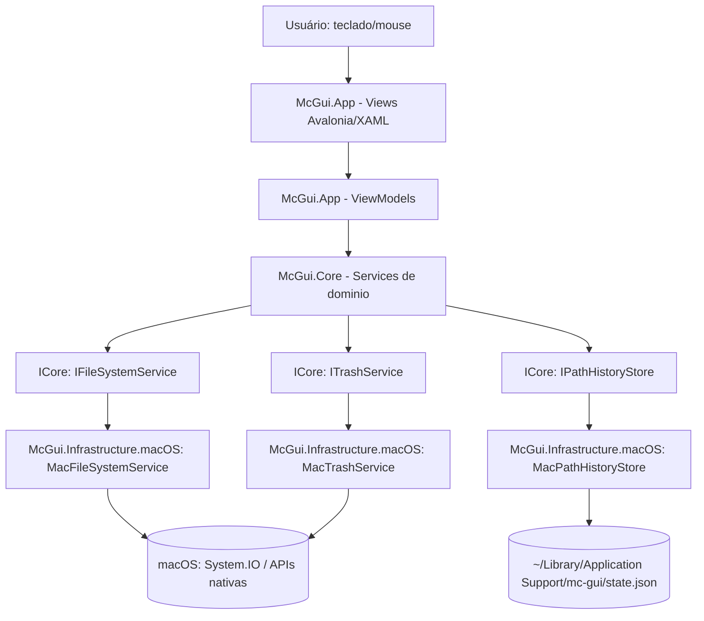

# Dual-Pane Core Design

**Spec**: `.specs/features/dual-pane-core/spec.md`
**Status**: Draft

---

## Architecture Overview

Solução modular multi-projeto (Approach 2 confirmada). Separação por responsabilidade em três projetos .NET, garantindo que código específico de macOS fique isolado atrás de interfaces desde o início — pré-requisito estrutural para portar Windows/Linux em features futuras sem reescrever `Core`/`App`.



**Fluxo de uma operação (ex.: Copiar, F5):** View dispara Command → PanelViewModel monta a lista de `FileEntry` marcadas → `CopyMovePlanner` (Core, sem dependência de SO) expande diretórios e detecta conflitos/circularidade → ViewModel abre `CopyMoveDialogViewModel` para confirmação/edição de destino → execução roda em `Task` de background chamando `IFileSystemService`, reportando progresso via `IProgress<OperationProgress>` consumido pela ViewModel na UI thread.

---

## Code Reuse Analysis

Projeto novo (`mc-gui` está vazio além de `.claude`/`.git`) — não há código existente do próprio repositório para reaproveitar. O reaproveitamento aqui é de bibliotecas de terceiros já maduras, evitando reinventar o que o ecossistema .NET/Avalonia já resolve:

| Componente externo | Fonte | Como usar |
| --- | --- | --- |
| Avalonia UI | pacote NuGet `Avalonia` (+ `Avalonia.Desktop`, `Avalonia.Fluent` para o tema Fluent Design decidido antes do Specify) | Shell de UI, controles, tema, roteamento de eventos de teclado |
| CommunityToolkit.Mvvm | pacote NuGet `CommunityToolkit.Mvvm` | `ObservableObject`/`RelayCommand` via source generators para ViewModels, menos boilerplate que ReactiveUI para o escopo desta feature (CRUD + progresso, sem streams reativos complexos) |
| `System.IO` (BCL) | .NET runtime | Enumeração de diretório, `File.Move`/`Copy`, checagem de espaço em disco (`DriveInfo`) |

### Integration Points

| Sistema | Método de integração |
| --- | --- |
| Sistema de arquivos local (macOS) | `McGui.Infrastructure.macOS.MacFileSystemService`, único ponto de chamada a `System.IO` para operações de arquivo |
| Trash do macOS | `McGui.Infrastructure.macOS.MacTrashService`, único ponto que manipula `~/.Trash` / `.Trashes/<uid>` |
| Estado persistido (últimos diretórios dos painéis) | `MacPathHistoryStore`, arquivo JSON em `~/Library/Application Support/mc-gui/state.json` |

---

## Components

### `McGui.Core` — Modelos e contratos de domínio (sem dependência de SO)

- **Purpose**: Definir os tipos e regras de negócio puras (seleção, planejamento de cópia/move, resolução de conflito) de forma testável e independente de plataforma.
- **Location**: `src/McGui.Core/`
- **Interfaces**:
  - `IFileSystemService.ListDirectory(path: string): IReadOnlyList<FileEntry>` - lista entradas de um diretório
  - `IFileSystemService.CreateDirectory(parentPath: string, name: string): void` - cria pasta (DPC-24/25/26)
  - `IFileSystemService.CopyAsync(plan: CopyMovePlan, progress: IProgress<OperationProgress>, ct: CancellationToken): Task<OperationResult>` - executa cópia (DPC-14..19)
  - `IFileSystemService.MoveAsync(plan: CopyMovePlan, progress: IProgress<OperationProgress>, ct: CancellationToken): Task<OperationResult>` - executa move/rename (DPC-20..23)
  - `ITrashService.Delete(entries: IReadOnlyList<FileEntry>, permanent: bool): OperationResult` - apaga com ou sem lixeira (DPC-27..31)
  - `IPathHistoryStore.Load(): PanelPathHistory` / `Save(history: PanelPathHistory): void` - persistência dos diretórios dos dois painéis (DPC-07/08)
  - `CopyMovePlanner.Build(sources: IReadOnlyList<FileEntry>, destinationDir: string, mode: OperationMode): CopyMovePlan` - expande diretórios recursivamente, detecta cópia/move circular (DPC-18, DPC-22) e entrada já ocupada no painel oposto (DPC-23)
  - `SelectionService.Toggle/MarkByPattern/UnmarkByPattern/Invert(state: PanelState, ...): PanelState` - regras de marcação (DPC-09..13)
- **Dependencies**: nenhuma (BCL apenas: `System`, `System.Collections.Generic`)
- **Reuses**: N/A (camada mais interna)

### `McGui.Infrastructure.macOS` — Implementação real para macOS

- **Purpose**: Implementar as interfaces de `Core` usando APIs de arquivo do macOS/.NET, isolando tudo que é específico de plataforma.
- **Location**: `src/McGui.Infrastructure.macOS/`
- **Interfaces**: implementa `IFileSystemService`, `ITrashService`, `IPathHistoryStore` de `McGui.Core`.
- **Dependencies**: `McGui.Core`, `System.IO`, `DriveInfo` (checagem de espaço, DPC-19)
- **Reuses**: contratos de `McGui.Core`; nenhuma lib de terceiros para trash (nenhuma opção madura encontrada na pesquisa — ver Risks & Concerns)

**Detalhe de `MacTrashService`**: move a entrada para `~/.Trash` (mesmo volume do home) ou `/Volumes/<vol>/.Trashes/<uid>` (volume diferente), renomeando em caso de colisão de nome (`arquivo.txt` → `arquivo 2.txt`, seguindo a convenção do Finder) - implementa DPC-28. Falha ao escrever no destino de trash (ex.: diretório sem permissão) retorna erro tratável em vez de apagar direto (ver Error Handling Strategy).

### `McGui.App` — UI Avalonia (Views + ViewModels)

- **Purpose**: Renderizar os dois painéis, a barra de function-keys e os diálogos, traduzindo entrada de teclado/mouse em chamadas aos serviços de `Core`.
- **Location**: `src/McGui.App/`
- **Interfaces**:
  - `MainWindowViewModel` - hospeda duas `PanelViewModel`, controla qual está ativa (DPC-02), roteia F1-F10
  - `PanelViewModel.NavigateTo/NavigateUp/ToggleMark/...` - estado de um painel (DPC-01..13, DPC-32..36)
  - `CopyMoveDialogViewModel`, `ConflictDialogViewModel`, `DeleteConfirmDialogViewModel`, `MkdirDialogViewModel` - um por diálogo modal do MVP
  - `KeyGestureMap` - tabela estática mapeando teclas (F1-F10, Tab, Insert, +, -, *, Ctrl+R, Ctrl+H, Backspace) para Commands, isolando o mapeamento de teclado clássico do MC num único lugar
- **Dependencies**: `McGui.Core`, `Avalonia`, `CommunityToolkit.Mvvm`
- **Reuses**: serviços de `Core` via injeção de dependência (um `IServiceProvider` simples montado em `App.axaml.cs`, resolvendo para as implementações de `McGui.Infrastructure.macOS`)

---

## Data Models

```csharp
public sealed record FileEntry(
    string Name,
    string FullPath,
    bool IsDirectory,
    long SizeBytes,
    DateTimeOffset ModifiedUtc,
    bool IsSymlink,
    bool IsHidden);

public sealed class PanelState
{
    public string CurrentDirectory { get; set; } = "";
    public IReadOnlyList<FileEntry> Entries { get; set; } = Array.Empty<FileEntry>();
    public int CursorIndex { get; set; }
    public HashSet<string> MarkedPaths { get; } = new();
    public PanelSortColumn SortColumn { get; set; } = PanelSortColumn.Name;
    public bool SortDescending { get; set; }
    public bool ShowHidden { get; set; }
    public string? FilterText { get; set; } // DPC-33
}

public enum PanelSortColumn { Name, Size, Date }
public enum OperationMode { Copy, Move }

public sealed record CopyMovePlan(
    IReadOnlyList<FileEntry> Sources,
    string DestinationDirectory,
    OperationMode Mode);

public sealed record OperationProgress(
    string CurrentFileName,
    int FilesDone,
    int FilesTotal,
    long BytesDone,
    long BytesTotal,
    bool IsCancelled);

public sealed record OperationResult(
    bool Succeeded,
    IReadOnlyList<(string Path, string Reason)> SkippedEntries);

public sealed record PanelPathHistory(string LeftPanelPath, string RightPanelPath);
```

**Relationships**: `PanelState` pertence 1:1 a uma `PanelViewModel`. `CopyMovePlan` é construído a partir de `PanelState.MarkedPaths` (ou da entrada sob o cursor) pelo `CopyMovePlanner` e consumido por `IFileSystemService`. `OperationResult` alimenta o diálogo de resumo de erros (DPC-19 parcial, DPC-31). `PanelPathHistory` é serializado para/de `state.json` por `IPathHistoryStore` (DPC-07/08).

---

## Error Handling Strategy

| Error Scenario | Handling | User Impact |
| --- | --- | --- |
| Conflito de nome no destino (Copy/Move) | Diálogo Overwrite/Skip/Rename/Abort com "aplicar a todos" (DPC-16) | Usuário decide por item ou em lote |
| Espaço em disco insuficiente, detectado antes de iniciar | Aborta antes de copiar nenhum byte, mostra bytes necessários vs. disponíveis (DPC-19) | Usuário sabe exatamente o motivo e a diferença de espaço |
| Falha de escrita durante a cópia (ex.: quota mudou, condição de corrida após o check inicial) | Pula apenas o arquivo atual, continua o restante do lote, registra no relatório final | Usuário vê a operação completar com um resumo dos itens pulados, em vez de um crash ou abort total |
| Permissão negada ao apagar/mover/copiar um item | Pula o item, continua os demais, relatório final com caminho + motivo (DPC-31) | Igual ao caso acima |
| Cópia/move circular (destino dentro da origem) | Rejeita a operação inteira antes de iniciar, com mensagem identificando o ciclo (DPC-18, DPC-22) | Erro claro, nada é escrito |
| Mover a pasta que é o diretório atual do painel oposto | Bloqueia com explicação antes de iniciar (DPC-23) | Usuário entende por que a ação foi impedida |
| Cancelamento pelo usuário durante Copy/Move | Encerra após o arquivo em andamento terminar, sem rollback dos já copiados (DPC-17) | Usuário fica com um estado parcial previsível, documentado no diálogo |
| Mover para a lixeira falha (ex.: `~/.Trash` sem permissão de escrita) | Mostra erro explicando a falha, oferece Excluir Permanentemente como alternativa explícita (nunca apaga direto sem essa escolha) | Nenhuma perda de dado silenciosa |
| Diretório do painel se torna inacessível enquanto exibido (volume desmontado) | Painel entra em estado de erro inline, oferece "ir para home" | Painel nunca trava mostrando uma listagem obsoleta sem aviso |

---

## Risks & Concerns

| Concern | Location (file:line) | Impact | Mitigation |
| --- | --- | --- | --- |
| Nenhuma biblioteca .NET madura e mantida para "mover para lixeira" cross-platform foi encontrada na pesquisa (WebSearch, sem resultado confiável) | `McGui.Infrastructure.macOS/MacTrashService.cs` (a criar) | Implementação própria de mover-para-`~/.Trash` carrega risco de casos de borda mal tratados (colisão de nome, volume externo via `.Trashes/<uid>`, pastas com permissão restrita, itens no iCloud Drive) | Escopo do MVP já limitado a macOS + sistema de arquivos local (spec); adicionar task dedicada de spike na fase Tasks para validar o comportamento real em disco antes de construir o fluxo de diálogo em cima disso; cobrir colisão de nome e permissão negada com testes automatizados |
| Sem confirmação prática (ainda) de que Avalonia recebe as teclas F1-F10 sem interceptação do macOS (Mission Control, teclas de mídia/Fn) | `McGui.App/KeyGestureMap.cs` (a criar) | Se o SO interceptar alguma F-key, o atalho correspondente fica inacessível via teclado físico | Task de spike na fase Tasks: testar captura de F1-F10 em uma janela Avalonia real no macOS antes de implementar todos os handlers; a barra de function-keys clicável (parte do MVP) já serve de fallback caso alguma tecla seja interceptada |
| Projeto começa do zero — nenhum código legado para reaproveitar ou dívida técnica herdada | N/A | N/A | N/A - primeira feature do repositório |

> Nenhum outro risco identificado nesta rodada de pesquisa.

---

## Tech Decisions (only non-obvious ones)

| Decision | Choice | Rationale |
| --- | --- | --- |
| Estrutura de solução | 3 projetos: `McGui.Core`, `McGui.Infrastructure.macOS`, `McGui.App` (Approach 2, confirmada com o usuário) | Torna "macOS primeiro, multiplataforma depois" uma fronteira de projeto/interface, não uma convenção de disciplina da equipe |
| Framework MVVM | CommunityToolkit.Mvvm (não ReactiveUI) | Menos boilerplate via source generators; esta feature não precisa de composição de streams reativos complexa, só comandos + notificação de propriedade |
| Implementação de Trash | Mover manualmente para `~/.Trash`/`.Trashes/<uid>`, atrás de `ITrashService`, sem biblioteca de terceiros | Pesquisa (Knowledge Verification Chain, passo 4) não encontrou pacote NuGet maduro para isso; ver Risks & Concerns para a mitigação do risco |
| Persistência de estado (últimos diretórios) | Arquivo JSON simples em `~/Library/Application Support/mc-gui/state.json` | Volume de dado mínimo (duas strings), não justifica banco de dados; segue a convenção padrão de app macOS |
| Execução de Copy/Move | `Task` em background + `IProgress<OperationProgress>` para a UI thread | Padrão .NET idiomático; atende DPC-15 (progresso) e DPC-17 (cancelamento) sem modelo de threading customizado |

> **Decisão de nível de projeto:** a estrutura de 3 projetos (Core / Infrastructure.\* / App) é um padrão que toda feature futura (editor, viewer, VFS remoto) deve seguir para manter o isolamento de plataforma. Será registrada como `AD-001` em `.specs/STATE.md`.
