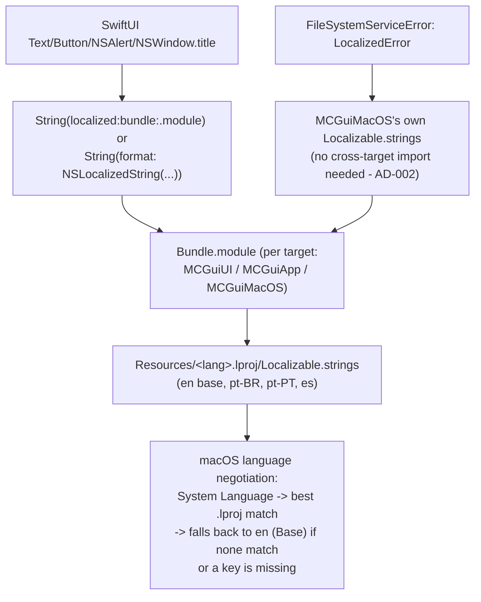

# Internationalization (i18n) Design

**Spec**: `.specs/features/i18n-localization/spec.md`
**Status**: Draft

---

## Architecture Overview

Standard Apple-native localization: classic `.strings` tables (one per language per
target that has user-facing strings), resolved at runtime through each target's own
`Bundle.module`, with macOS's built-in language negotiation and Base-region fallback
doing the "pick the right language, fall back to English" work for free - no custom
fallback logic.

Each SPM target's generated resource bundle (`MCGui_<Target>.bundle`) ships next to the
executable in the local `swift build` output; the packaged `.app` needs those bundles
copied into `Contents/Resources/` for `Bundle.module`'s resolution chain to find them at
runtime (see Risk 2 below) - this is new work, `packaging/build-macos.sh` does not do it
today for any resource, not just localization.

---

## Code Reuse Analysis

### Existing Components to Leverage

| Component | Location | How to Use |
| --- | --- | --- |
| `BookmarksActions`/`UserMenuActions`/`AppCommandActions` cross-target bridge pattern | `Sources/MCGuiApp/AppEntry.swift` | Not needed for strings themselves (each target owns its own `.strings`), but confirms AD-002's boundary is already handled this way elsewhere - i18n follows the same discipline, not a new pattern. |
| `Error` → `operationErrorMessage`/`fo15Message` display slots | `Sources/MCGuiUI/Views/PanelView.swift:567-571,728-734` | Reused as-is; only the *content* of the error string changes (from raw/`localizedDescription` dump to a properly localized message), not the display plumbing. |
| `packaging/build-macos.sh`'s existing icon-copy step | `packaging/build-macos.sh` | Same copy-into-`Contents/Resources` pattern extended to the new `.bundle` directories. |

### Integration Points

| System | Integration Method |
| --- | --- |
| `Package.swift` | Each of `MCGuiUI`, `MCGuiApp`, `MCGuiMacOS` targets gains `resources: [.process("Resources")]`. |
| `packaging/Info.plist` | Add `CFBundleLocalizations` (en, pt-BR, pt-PT, es) and `CFBundleDevelopmentRegion` (en). |
| `packaging/build-macos.sh` | New step: copy every `MCGui_<Target>.bundle` from `swift build`'s bin path into `$APP_DIR/Contents/Resources/`. |

---

## Components

### Localizable.strings tables (×3 targets × 4 languages)

- **Purpose**: Hold every UI string as `"namespaced.key" = "Translated text";`, one file per language per target.
- **Location**: `Sources/MCGuiUI/Resources/{en,pt-BR,pt-PT,es}.lproj/Localizable.strings`, `Sources/MCGuiApp/Resources/{...}.lproj/Localizable.strings`, `Sources/MCGuiMacOS/Resources/{...}.lproj/Localizable.strings` (only for `FileSystemServiceError`'s messages - MCGuiMacOS has no other UI).
- **Interfaces**: consumed via `String(localized: "key", bundle: .module, comment: "...")` (static strings) or `String(format: NSLocalizedString("key", bundle: .module, comment: "..."), arg1, arg2)` (parameterized strings - see Tech Decisions for why `.strings` needs this form instead of Swift's interpolated `String(localized:)`).
- **Dependencies**: `Package.swift` resource declarations.
- **Reuses**: nothing - net-new.

### `FileSystemServiceError: LocalizedError` conformance

- **Purpose**: Turn today's developer-facing `String(describing: typed)` dump (`FileSystemServiceImpl.swift:483`) into a real per-case localized message, without MCGuiUI ever needing to import MCGuiMacOS (AD-002).
- **Location**: `Sources/MCGuiMacOS/FileSystem/FileSystemServiceImpl.swift` (extend `FileSystemServiceError`).
- **Interfaces**: `var errorDescription: String? { get }` - one `String(format: NSLocalizedString(...))` per case (`.permissionDenied(URL)`, `.alreadyExists(URL)`, `.fileInUse(URL)`, `.insufficientDiskSpace`, `.volumeDisconnected(URL)`, `.pathTooLong(URL)`).
- **Dependencies**: `MCGuiMacOS`'s own `Localizable.strings`.
- **Reuses**: `PanelView.swift`'s existing `error.localizedDescription` call sites - unchanged, they already invoke the protocol's standard accessor; only what it returns changes.

### Localization coverage test (P2 / I18N-09)

- **Purpose**: Fail `swift test` when any target's pt-BR/pt-PT/es `Localizable.strings` is missing a key present in that target's `en.lproj` (or has an extra/orphaned one) - a testable, CI-visible substitute for Xcode String Catalog's translation-state UI, which `.strings` files don't have natively.
- **Location**: new `tests/MCGuiUITests/Localization/LocalizationCoverageTests.swift` (parses all 3 targets' resource directories via a relative path from the test bundle, or a small parsing helper reused across cases).
- **Interfaces**: one `@Test` per target, each asserting `Set(keys(in: "pt-BR.lproj")) == Set(keys(in: "en.lproj"))` (and same for pt-PT, es).
- **Dependencies**: none beyond `Foundation` (a `.strings` file is trivially parsable: skip comments, split on ` = `).
- **Reuses**: nothing - net-new, but mirrors this project's existing pattern of plain `swift test`-driven gates (e.g. `OperationProgressTrackerTests`, `UserMenuRunnerTests`) rather than inventing new tooling.

---

## Data Models

N/A - no persisted data. Language is derived from macOS System Language at launch, never stored by the app (per the spec's confirmed decision to skip an in-app language picker).

---

## Error Handling Strategy

| Error Scenario | Handling | User Impact |
| --- | --- | --- |
| A specific key is missing from the resolved locale's `.strings` | Foundation's built-in fallback to the Base/development region (`en`) - no custom code | User sees the English string for that one entry; rest of the screen stays in their language |
| System Language is none of the 4 supported | Foundation's built-in language negotiation resolves to the Base region (`en`) automatically | Whole app in English |
| A target's resource `.bundle` is missing from the packaged `.app` (packaging bug) | SPM's generated `Bundle.module` accessor `fatalError`s if it can't find the bundle anywhere in its search chain | App crashes at first localized-string access - this is exactly why I18N-08 (packaging) and the DMG smoke test in Success Criteria are P1, not optional polish |
| pt-BR/pt-PT/es `.strings` genuinely missing a key vs. `en.lproj` (translation gap, not a runtime bug) | Caught at `swift test` time by the coverage test (I18N-09), not silently shipped | Developer sees a failing test before merge, not a user seeing English mixed into another language in production |

---

## Risks & Concerns

| Concern | Location (file:line) | Impact | Mitigation |
| --- | --- | --- | --- |
| Error messages are currently developer-facing, not localizable as-is | `Sources/MCGuiMacOS/FileSystem/FileSystemServiceImpl.swift:483` (`String(describing: typed)`), `Sources/MCGuiUI/Views/PanelView.swift:571` (`error.localizedDescription`) | Without a fix, "error/alert messages" (explicitly in scope per I18N-01..04) would still show raw English/Swift-internal text in every language | `FileSystemServiceError: LocalizedError` component above |
| `packaging/build-macos.sh` copies only the executable and the app icon into `Contents/Resources` - never any SPM-generated resource `.bundle` | `packaging/build-macos.sh` (Assemble step, confirmed by reading the whole script - no `.bundle` copy exists today) | Every target's `Resources/` content, not just localization, currently never reaches the installed `.app` at all - this is a pre-existing packaging gap i18n is the first feature to depend on | New copy step for `MCGui_<Target>.bundle` dirs (Architecture Overview); verified via the DMG smoke test in spec.md's Success Criteria, not assumed |
| SPM's exact `Bundle.module` resource-resolution search order (candidate paths, generated bundle naming) is documented, well-established behavior, but not something this design has run and inspected in *this* repo yet | N/A (not yet implemented) | Wrong assumption here would silently break resolution only in the packaged `.app`, not in `swift run`/`swift test` (which find the bundle next to the local build output regardless) - easy to miss until someone actually launches the DMG | First implementation task adds resources to exactly one target, builds, and inspects the actual generated bundle name/location before wiring the rest - verify, don't assume |
| The ~183 string-literal count is a rough regex-based estimate across `Sources/MCGuiUI`, `Sources/MCGuiApp`, `Sources/MCGuiMacOS` | N/A (estimation artifact) | Actual translation volume - especially `HelpWindow.swift`'s static reference content - could run higher, affecting task sizing | Tasks phase does a precise per-file audit before finalizing the task list |
| Some existing tests likely assert literal English button/dialog/error text | Not yet audited file-by-file | A string becoming a `.strings` lookup could break a test asserting the old English literal, even though English itself hasn't changed (test host locale defaults to `en` in Swift Testing, which is the same text - risk is on tests asserting *identity of source*, e.g. mirroring the exact pre-localization literal, not behavior) | Tasks phase audits and updates affected tests per component, as each string is extracted - never batched/deferred to the end |

---

## Tech Decisions

| Decision | Choice | Rationale |
| --- | --- | --- |
| Localization file format | Classic `.strings` (not `.xcstrings` String Catalogs) | User confirmed. Hand-editable plain text, git-diff-friendly, no risk of a malformed proprietary JSON catalog authored outside Xcode's editor. |
| String key convention | Namespaced dotted keys (e.g. `copyMove.button.background`), never the literal English text as the key | Stable across future English wording tweaks; avoids quoting/escaping English punctuation inside a `.strings` key. |
| Parameterized strings (byte counts, file counts, "+N more") | `NSLocalizedString(key, bundle: .module, comment:)` + `String(format:)` with positional `%1$d`/`%2$@` specifiers | Swift's newer `String(localized: "text \(interpolated)")` form uses the *interpolated result* as the lookup key by default when not paired with Xcode's String Catalog compiler - wrong for `.strings` tables, where the key must stay constant across all possible argument values. The classic `NSLocalizedString` + `String(format:)` pair is the correct, `.strings`-native mechanism for this and needs no tooling beyond `Bundle.module`. |
| Error message localization | `LocalizedError` conformance on `FileSystemServiceError`, backed by `MCGuiMacOS`'s own `Localizable.strings` | Keeps AD-002's module boundary intact (`MCGuiUI` never imports `MCGuiMacOS`) - `PanelView.swift`'s existing `error.localizedDescription` call sites already work correctly once the protocol conformance exists, no call-site changes needed. |
| Missing-translation detection (I18N-09) | A `swift test` key-set-diff test per target, not Xcode's String Catalog translation-state UI | `.strings` has no built-in translation-state tracking; a plain test fits this project's existing `swift test`-as-the-gate culture (matches `check_commit.py`/`validate_*.py`'s spirit: deterministic, CI-visible, not manual). |
| Locale negotiation and English fallback (I18N-05, I18N-06) | Rely entirely on Apple's built-in Base-region fallback - no custom fallback code | This is exactly what `CFBundleDevelopmentRegion`/Base `.lproj` negotiation is for; reinventing it risks getting the actual macOS behavior wrong. Correctness is contingent on `en.lproj` always being complete, which the coverage test enforces the other direction for (every pt-BR/pt-PT/es key must exist in en too). |

> **Project-level decision**: this localization architecture (format, key convention, per-target `Bundle.module` resolution, error-message pattern) is the convention future features must follow when adding new user-facing strings. Recorded as `AD-005` in `.specs/STATE.md`.
