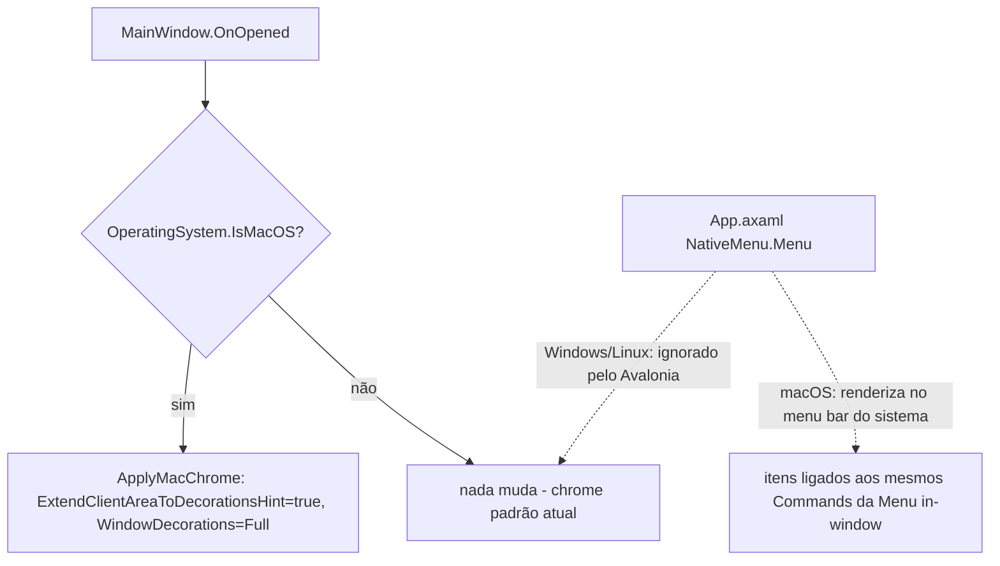

# macOS Native Chrome Design

**Spec**: `.specs/features/macos-native-chrome/spec.md`
**Status**: Approved

---

## Architecture Overview

Sem componente novo, sem projeto novo. Tudo fica em `McGui.App` (`MainWindow.axaml`/`.axaml.cs`, `App.axaml`, `Themes.axaml`, `PanelView.axaml`), reaproveitando os hooks que já existem (`OnOpened`, `OnDataContextChanged`/`ApplyTheme`). A única decisão de arquitetura é: **onde mora o `if (OperatingSystem.IsMacOS())`** — ele fica isolado num único método (`ApplyMacChrome`), chamado uma vez em `OnOpened`, ao invés de espalhado em vários pontos.

**Conforme AD-001**: não há chamada de API de SO nova aqui — `ExtendClientAreaToDecorationsHint`, `WindowDecorations` e `NativeMenu` já são abstrações cross-platform do próprio Avalonia (`NativeMenu` é ignorado automaticamente em SOs sem menu bar do sistema, confirmado na doc oficial). Não há necessidade de `McGui.Infrastructure.macOS`; a decisão de layering do AD-001 continua válida e não é violada.

---

## Code Reuse Analysis

### Existing Components to Leverage

| Component | Location | How to Use |
| --- | --- | --- |
| `OnOpened` (aplica accent de sistema hoje) | `MainWindow.axaml.cs:29` | Mesmo método ganha uma chamada a `ApplyMacChrome()` no início, guardada por `OperatingSystem.IsMacOS()` |
| `ApplyTheme`/`OnViewModelPropertyChanged` (já reage a troca de tema) | `MainWindow.axaml.cs:82-107` | Reaproveitado como está — os novos brushes de `Themes.axaml` já são `DynamicResource`, então trocam sozinhos quando o tema muda; nenhuma lógica nova de reaplicação é necessária |
| `Style Selector` em `Border.panelRoot`/`Border.panelRoot.active` | `Views/PanelView.axaml:10-18` | Mesmo padrão usado para o novo `Style Selector="ListBoxItem:pointerover"` / `ListBoxItem:selected"` — sem introduzir mecanismo novo |
| `ResourceDictionary.ThemeDictionaries` (Light/Dark) | `Themes.axaml` | Novas chaves de brush (`NativeListHoverBrush`, `NativeListSelectedBrush`, `NativeToolbarButtonBrush` etc.) entram nos blocos `Light`/`Dark` existentes, mesmo padrão das chaves atuais |
| `MenuItem` com `Command`/`CommandParameter`/`IsEnabled` já bindados | `MainWindow.axaml:12-115` | O `NativeMenu` novo em `App.axaml` referencia os **mesmos bindings** (mesma sintaxe `{Binding ...}` contra o `MainWindowViewModel` já exposto como `DataContext` da janela) — nenhum `Command` novo no ViewModel |
| Botões F1-F10 (`Button` com `Command`) | `MainWindow.axaml:135-144` | Só ganham `Classes="fkey"` + `Style Selector=".fkey"` novo; `Command`/`CommandParameter`/`IsEnabled` inalterados |

### Integration Points

| System | Integration Method |
| --- | --- |
| Avalonia Window chrome | `ExtendClientAreaToDecorationsHint` + `WindowDecorations="Full"` (mantém semáforo nativo do SO) - setados via código em `ApplyMacChrome()`, não em XAML, porque dependem de `OperatingSystem.IsMacOS()` em runtime |
| Avalonia `NativeMenu` | `NativeMenu.Menu` anexado à `Window` em `MainWindow.axaml` (não em `App.axaml` - o app não tem menu de "Application" próprio, só os menus já existentes de `_Left.._Right`), espelhando 1:1 os headers/itens/bindings da `Menu` in-window |

---

## Components

### `MainWindow` (ajuste, sem componente novo)

- **Purpose**: Aplicar chrome estendido + semáforo inline apenas no macOS, sem alterar Windows/Linux.
- **Location**: `src/McGui.App/MainWindow.axaml.cs`
- **Interfaces**:
  - `private void ApplyMacChrome()` - chamado em `OnOpened` quando `OperatingSystem.IsMacOS()`; seta `ExtendClientAreaToDecorationsHint = true`, `WindowDecorations = WindowDecorations.Full`, `ExtendClientAreaTitleBarHeightHint` (valor padrão do Avalonia, sem hardcode de pixel).
- **Dependencies**: nenhuma nova (usa só a própria `Window`).
- **Reuses**: `OnOpened` já existente.

### `MainWindow.axaml` - `NativeMenu.Menu`

- **Purpose**: Espelhar os headers/itens da `Menu` in-window no menu bar nativo do macOS.
- **Location**: `src/McGui.App/MainWindow.axaml`
- **Interfaces**: bloco `<NativeMenu.Menu>` com `<NativeMenuItem Header="..." Command="{Binding ...}" IsEnabled="{Binding ...}"/>` para cada item hoje presente na `Menu` (mesmos `Command`/`CommandParameter`/`IsEnabled`).
- **Dependencies**: `MainWindowViewModel` (mesmo `DataContext` já usado pela `Menu`).
- **Reuses**: todos os `Command`s já existentes no ViewModel - nenhum novo.

### `Themes.axaml` - brushes nativos

- **Purpose**: Fornecer os brushes usados pelo restyle de lista e barra F1-F10.
- **Location**: `src/McGui.App/Themes.axaml`
- **Interfaces**: novas chaves `SolidColorBrush` dentro de `Light`/`Dark` (ex.: `NativeListHoverBrush`, `NativeListSelectedBrush`, `NativeToolbarBackgroundBrush`, `NativeToolbarButtonForegroundBrush`).
- **Dependencies**: nenhuma.
- **Reuses**: mesmo mecanismo de `ThemeDictionaries` já usado pelas chaves atuais (`PanelBorderBrush` etc.).

### `PanelView.axaml` - estilo de `ListBoxItem`

- **Purpose**: Hover/seleção com aparência nativa (sem zebra-striping - ver Assumptions do spec).
- **Location**: `src/McGui.App/Views/PanelView.axaml`
- **Interfaces**: `Style Selector="ListBox.native ListBoxItem:pointerover"` e `:selected`, usando `{DynamicResource NativeListHoverBrush}`/`NativeListSelectedBrush`. Classe `native` só aplicada quando `OperatingSystem.IsMacOS()` (bind a uma propriedade booleana simples exposta em code-behind ou `PanelView.axaml.cs`, seguindo o mesmo padrão de `Classes.active="{Binding IsActive}"` já usado na linha 20).
- **Dependencies**: nenhuma nova.
- **Reuses**: `Style Selector` já existente no arquivo.

### `MainWindow.axaml` - barra F1-F10

- **Purpose**: Restyle visual dos botões, mesmo comportamento.
- **Location**: `src/McGui.App/MainWindow.axaml`
- **Interfaces**: `Classes="fkey"` nos `Button` existentes (linhas 135-144) + `Style Selector=".fkey"`/`.fkey:pointerover` novo no `<Window.Styles>` ou `Themes.axaml`, usando `NativeToolbarButtonForegroundBrush`.
- **Dependencies**: nenhuma nova.
- **Reuses**: `Command`/`CommandParameter`/`IsEnabled` de cada botão, inalterados.

---

## Data Models

N/A - feature é puramente visual/chrome, sem modelo de dados novo.

---

## Error Handling Strategy

| Error Scenario | Handling | User Impact |
| --- | --- | --- |
| `ExtendClientAreaToDecorationsHint` não suportado na versão de macOS/Avalonia em runtime | Avalonia já degrada para chrome padrão internamente (comportamento de framework, não precisa de try/catch nosso) | Janela abre normal, sem semáforo inline (mesma UX de hoje) |
| `NativeMenu` sem menu bar disponível (ex.: CI headless) | Avalonia ignora silenciosamente (documentado); `Menu` in-window continua ativa | Nenhum - app funciona via menu in-window |

---

## Risks & Concerns

| Concern | Location | Impact | Mitigation |
| --- | --- | --- | --- |
| `ExtendClientAreaChromeHints` (API usada em exemplos antigos/WPF-migration) foi removida no Avalonia 12 | `src/McGui.App/McGui.App.csproj:11` (Avalonia 12.1.2) | Copiar um snippet desatualizado quebraria o build | Confirmado via Context7 (doc oficial Avalonia) que a API correta em v12 é `WindowDecorations` + `ExtendClientAreaToDecorationsHint`; nenhuma referência a `ExtendClientAreaChromeHints` nesta feature |
| Avalonia não tem `AlternationCount`/zebra-striping confirmado para `ListBox` | N/A (API não encontrada na doc) | Implementar algo não documentado gera comportamento não testável/instável | Escopo de P3 reduzido a hover/seleção via `Style Selector` (já confirmado no projeto) - decisão registrada no spec |

> Nenhum outro concern encontrado nos arquivos tocados por esta feature.

---

## Tech Decisions

| Decision | Choice | Rationale |
| --- | --- | --- |
| Onde aplicar o guard de plataforma | Método único `ApplyMacChrome()` chamado de `OnOpened`, guardado por `OperatingSystem.IsMacOS()` | Solução mais simples: um ponto de entrada, sem interface/abstração nova, consistente com o padrão já usado em `McGui.Infrastructure` (`OperatingSystem.IsMacOS() || OperatingSystem.IsLinux()`) |
| Chrome API do Avalonia 12 | `ExtendClientAreaToDecorationsHint="true"` (via code-behind) + `WindowDecorations="Full"` | `WindowDecorations="Full"` mantém os botões nativos do SO (semáforo real) junto do título estendido; `ExtendClientAreaChromeHints` foi removido nesta major version |
| Onde vive o `NativeMenu` | Anexado à `Window` (`MainWindow.axaml`), não à `Application` | O app não tem "menu de aplicação" macOS separado (About/Preferences); os headers `_Left/_File/_Command/_Options/_Right` já são os menus da janela - anexar à `Window` é o padrão de menu de janela documentado pelo Avalonia |
| Estilo de lista | Sem zebra-striping; só hover/seleção via `Style Selector` já usado no projeto | Segue a diretriz de simplicidade do usuário: reaproveita mecanismo existente ao invés de introduzir API não confirmada |

Nenhuma decisão aqui estabelece convenção de projeto nova além do que já está em AD-001 (conformidade, sem superseder).
